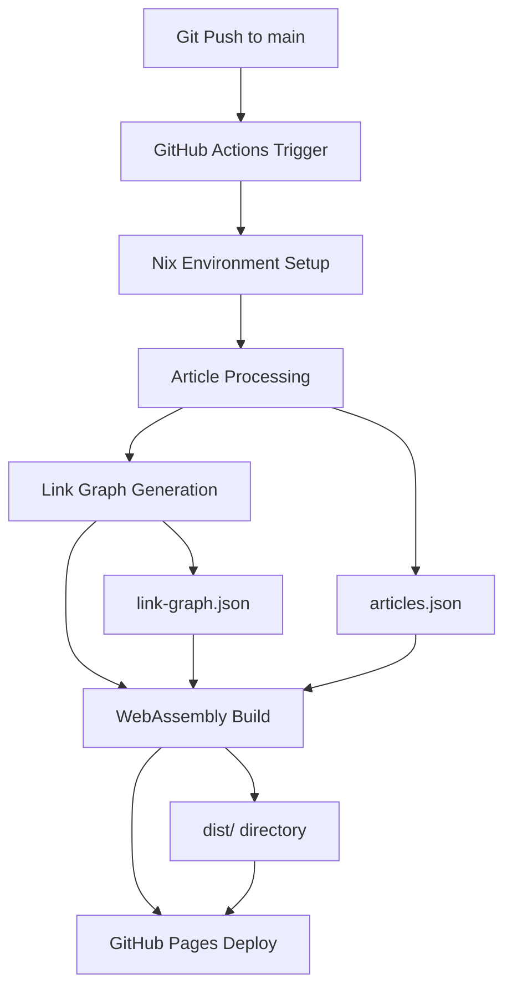

# Design Document

## Overview

このドキュメントでは、khimoo.ioポートフォリオサイトのGitHub Actions CI/CDシステムの設計について説明します。システムは、記事ファイルの変更を検知し、記事間のリンク関係性を抽出し、WebAssemblyベースのポートフォリオサイトを自動的にビルド・デプロイします。

**主要な設計原則:**
- Nix環境による再現可能なビルド環境の活用
- 段階的なビルドプロセス（記事処理 → WebAssemblyビルド → デプロイ）
- 既存のRustツールチェーンとの統合
- GitHub Pagesへの自動デプロイ

## Architecture

### システム全体のアーキテクチャ



### ワークフロー設計

**Phase 1: Environment Setup**
- Nixを使用した再現可能な環境構築
- Rustツールチェーンとwasm32-unknown-unknownターゲットの準備
- Trunkとその他の依存関係のインストール

**Phase 2: Article Processing**
- 記事ファイル（.md）の解析と処理
- 記事間のリンク関係性の抽出
- JSONデータファイルの生成

**Phase 3: WebAssembly Build**
- Rustコードのwasm32-unknown-unknownターゲットへのコンパイル
- Trunkを使用したWebAssemblyアプリケーションのビルド
- 静的アセットの最適化

**Phase 4: Deployment**
- GitHub Pagesへの自動デプロイ
- カスタムドメインの設定（必要に応じて）

## Components and Interfaces

### 1. GitHub Actions Workflow

**ファイル:** `.github/workflows/ci-cd.yml`

**責任:**
- mainブランチへのpushイベントの検知
- Nix環境のセットアップ
- ビルドプロセスの実行
- デプロイメントの管理

**インターフェース:**
```yaml
# トリガー条件
on:
  push:
    branches: [main]
    paths: ['khimoo-portfolio/**', 'articles/**']

# 環境変数
env:
  CARGO_TERM_COLOR: always
  NIX_CONFIG: "experimental-features = nix-command flakes"
```

### 2. Nix Environment Manager

**責任:**
- 再現可能なビルド環境の提供
- Rustツールチェーンの管理
- WebAssembly関連ツールの提供

**インターフェース:**
```nix
# flake.nixで定義された開発環境
devShells.default = pkgs.mkShell {
  buildInputs = [
    rustToolchain
    trunk
    wasm-pack
    # その他の依存関係
  ];
};
```

### 3. Article Processing Pipeline

**責任:**
- Markdownファイルの解析
- 記事メタデータの抽出
- リンク関係性の分析

**インターフェース:**
```rust
// 既存のバイナリを活用
cargo run --bin process-articles
cargo run --bin generate-link-graph
cargo run --bin validate-links
```

**出力データ:**
- `khimoo-portfolio/data/articles.json`
- `khimoo-portfolio/data/link-graph.json`
- `khimoo-portfolio/data/validation-report.json`

### 4. WebAssembly Build System

**責任:**
- RustコードのWebAssemblyへのコンパイル
- 静的アセットのバンドル
- 本番用最適化

**インターフェース:**
```bash
# Trunkを使用したビルド
trunk build --release --public-url /khimoo.io/
```

**出力:**
- `khimoo-portfolio/dist/` ディレクトリ
- 最適化されたWebAssemblyバイナリ
- HTMLとCSSアセット

### 5. Deployment Manager

**責任:**
- GitHub Pagesへのデプロイ
- 404ページの設定
- デプロイ状況の監視

**インターフェース:**
```yaml
# peaceiris/actions-gh-pages@v3を使用
with:
  github_token: ${{ secrets.GITHUB_TOKEN }}
  publish_dir: ./public
```
## 
Data Models

### Workflow Configuration

```yaml
# .github/workflows/ci-cd.yml
name: CI/CD Pipeline
on:
  push:
    branches: [main]
    paths: 
      - 'khimoo-portfolio/**'
      - 'articles/**'
      - 'flake.nix'
      - 'flake.lock'

jobs:
  build-and-deploy:
    runs-on: ubuntu-latest
    steps:
      - name: Checkout
      - name: Setup Nix
      - name: Process Articles
      - name: Build WebAssembly
      - name: Deploy to GitHub Pages
```

### Build Artifacts

```json
// articles.json structure
{
  "articles": [
    {
      "id": "string",
      "title": "string",
      "path": "string",
      "content": "string",
      "links": ["string"],
      "metadata": {}
    }
  ]
}

// link-graph.json structure
{
  "nodes": [
    {
      "id": "string",
      "title": "string",
      "type": "article"
    }
  ],
  "edges": [
    {
      "source": "string",
      "target": "string",
      "weight": "number"
    }
  ]
}
```

### Environment Variables

```bash
# CI環境で使用される環境変数
CARGO_TERM_COLOR=always
NIX_CONFIG="experimental-features = nix-command flakes"
GITHUB_TOKEN=${{ secrets.GITHUB_TOKEN }}
```

## Error Handling

### 1. Build Failure Handling

**記事処理エラー:**
- 不正なMarkdown形式の検出
- リンク検証の失敗
- JSONファイル生成エラー

**対応策:**
- 詳細なエラーログの出力
- 部分的な成功でもビルドを継続
- エラー通知の設定

### 2. WebAssembly Build Errors

**コンパイルエラー:**
- Rustコードの構文エラー
- 依存関係の問題
- wasm32ターゲットの問題

**対応策:**
- Cargoの詳細なエラー出力
- 依存関係の事前検証
- ビルドキャッシュの活用

### 3. Deployment Failures

**GitHub Pagesエラー:**
- 認証の問題
- ファイルサイズ制限
- デプロイ権限の問題

**対応策:**
- トークン権限の確認
- ファイルサイズの監視
- デプロイ状況の詳細ログ

### 4. Environment Setup Errors

**Nix環境エラー:**
- flake.nixの構文エラー
- 依存関係の解決失敗
- キャッシュの問題

**対応策:**
- Nixの詳細なエラー出力
- 依存関係の段階的インストール
- フォールバック環境の準備

## Testing Strategy

### 1. Unit Testing

**記事処理テスト:**
```rust
#[cfg(test)]
mod tests {
    #[test]
    fn test_article_parsing() {
        // Markdownファイルの解析テスト
    }
    
    #[test]
    fn test_link_extraction() {
        // リンク抽出の正確性テスト
    }
}
```

### 2. Integration Testing

**ワークフローテスト:**
- プルリクエストでのCI実行
- テスト用ブランチでの完全なビルドテスト
- デプロイメントのドライラン

### 3. End-to-End Testing

**デプロイメントテスト:**
- GitHub Pagesでのサイト表示確認
- リンクの動作確認
- パフォーマンステスト

### 4. Environment Testing

**Nix環境テスト:**
- 異なるプラットフォームでのビルド確認
- 依存関係の整合性テスト
- キャッシュ効率のテスト

### 5. Monitoring and Alerting

**ビルド監視:**
- GitHub Actionsの実行状況監視
- ビルド時間の追跡
- 失敗率の監視

**デプロイメント監視:**
- サイトの可用性監視
- パフォーマンス指標の追跡
- エラー率の監視